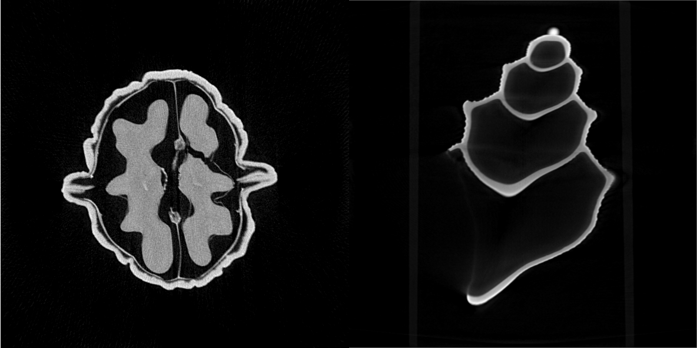

# Summary

elsa is a versatile framework in the landscape of X-ray tomography, offering a powerful toolkit for developing iterative reconstruction algorithms. Primarily designed for challenging applications in classical attenuation X-ray computed tomography (CT) and advanced modalities like Phase-Contrast X-ray CT (PCCT) [@pfeiffer2006] or Anisotropic Dark-field tomography (AXDT) [@wieczorek2016]. elsa stands out with an expansive set of building blocks and a unified abstraction, providing the means for high-quality reconstructions across a spectrum of imaging modalities and applications.

Designed as an operator- and optimisation-based framework, elsa takes a mathematical approach to model the reconstruction pipeline of imaging modalities. Through formulating optimization problems and a suite of iterative reconstruction algorithms, elsa addresses challenges in attenuation X-ray CT, PCCT, and AXDT.

The core of elsa, developed in modern C++ with GPU acceleration, ensures efficiency, while its Python interface enhances accessibility for students and researchers.

Distinctively, elsa positions itself as a unique solution by supporting modern iterative reconstruction techniques for novel X-ray CT imaging modalities. The framework addresses challenges associated with X-ray CT with arbitrary trajectories, automatic differentiation, differential signals for PCCT, and spherical function valued reconstructions for AXDT, offering a simple abstraction for implementing tailored reconstruction methods.

# Statement of need

The introduction of X-ray Computed Tomography (CT) in the 1970s revolutionized medical diagnostics, offering unprecedented insights into the human body's internal structures. Unlike traditional radiography, CT requires reconstructions through computation, which introduced the need for software frameworks. Popular frameworks include ASTRA [@vanAarle2016], SCICO [@balke2022], and the Core Imaging Library [@Jrgensen2021;@Papoutsellis2021], or ODL [@Adler2017]. These standard reconstructions of attenuation X-ray CT can also be performed using elsa, see \autoref{fig:seashell_walnut}.

<!-- todo: white separator between images, todo: see example-tool x in the repo.-->

In recent years, one of the major challenges tackled by research is the reduction of X-ray dose. As X-ray dose can harm humans, reducing it as much as possible is vital. However, reducing the X-ray dose results in worse reconstruction quality. Many reconstruction techniques have been developed to maintain a high reconstruction quality with a reduced X-ray dosage. However, till today, this remains an open problem. \autoref{fig:2detect} highlights this challenge on the 2DeteCT dataset [@kiss2023]. It illustrates the intricacies of low-dose reconstruction and demonstrates the versatility of elsa in handling diverse optimization problems for different noise assumptions.

<!-- TODO mention example code that generates this. -->
![Reconstruction of slice 29 of the 2DeteCT dataset [@kiss2023] visualizing the difference between high-dose and different low-dose reconstructions. The leftmost image displays a reconstruction using high-dose data (with least squares data term), while the subsequent three images represent reconstructions using low-dose measurements, from left to right: with Gaussian, non-stationary Gaussian, and Poisson noise based data terms. \label{fig:2detect}](imgs/2detect.png)

Classical X-ray CT, reliant on X-ray attenuation, faces limitations in soft tissue contrast and spatial resolution. With the advent of modern imaging modalities, consideration of additional physical effects, such as refraction and scatter, introduce both opportunities and challenges. A particularly challenging example (AXDT) is shown in \autoref{fig:axdt}, demonstrating the ability to reconstruct high-dimensional spherical scattering functions.

In this landscape, elsa is a distinctive framework focusing on iterative reconstruction techniques for modern X-ray CT imaging modalities. Offering a rich set of tools, elsa addresses challenges in fields like X-ray CT with arbitrary trajectories, automatic differentiation, differential signals for PCCT, and spherical function valued reconstructions for AXDT. Its unique contribution lies in supporting novel X-ray-based imaging modalities, while providing a versatile platform for tailored reconstruction methods.

elsa has been integral to our group's research and vital to scientific publications. Noteworthy applications include robotic X-ray CT and trajectory optimization [@pekel2022xray;@pekel2022geometric;@pekel2023], as well as successful integration with deep learning approaches [@cheslerean2023wnet]. Recognized in scientific conferences [@Lasser19;@frank2023], elsa is an indispensable tool, contributing significantly to advancing the field of X-ray tomography.

# Supported Features

Reconstruction problems are formulated as mathematical optimization problems within elsa, i.e. one minimizes a data fidelity term, augmented with regularization for incorporating prior knowledge. The framework automatically computes gradients for these problems.

elsa accommodates diverse data fidelity terms, such as (weighted) least squares and Poisson log-likelihood, and supports a variety of regularization techniques, including L2, sparsity-inducing L1, total variation, and Plug-and-Play (PnP) priors.

Tailoring to specific problem formulations, elsa supports a diverse set of iterative reconstruction algorithms, including gradient-based methods (FGM, OGM), splitting-based methods (ISTA, FISTA, ADMM), and primal-dual algorithms (PDHG).

The framework implements multiple forward model approximations for attenuation X-ray CT, available for both CPU and CUDA. These approximations support arbitrary cone-beam geometry via projection matrices. For PCCT, the forward model employs differentiable Kaiser-Bessel basis functions and B-Splines, with additional support for spherical functions and harmonics.

elsa implements different approximations of the forward model for attenuation X-ray CT. These approximations include the so-called Siddons and Josephs method and are implemented both for CPU and CUDA. All our models support arbitrary cone-beam geometry, which can be represented using a projection matrix. For PCCT, the forward model is implement using both differentiable Kaiser-Bessel basis functions and B-Splines. Further spherical functions and spherical harmonics are implemented in the framework.

Developed in modern C++, elsa features an accessible Python interface. Comprehensive Python examples, such as those in \autoref{fig:seashell_walnut} and \autoref{fig:2detect}, accompany the software. The documentation, hosted at \url{https://ciip.in.tum.de/elsadocs/}, includes API documentation, guides, and tutorials. elsa maintains code correctness and quality through a stable, continuously running CI pipeline and high test coverage.

# Acknowledgment

We thank our current and past contributors and students who made elsa into what it is today!

# References
