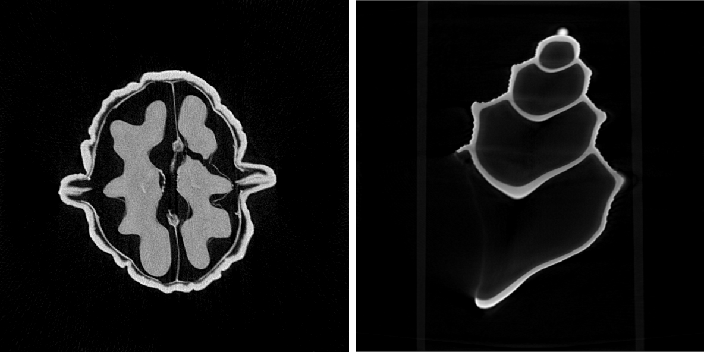

# Summary

elsa is a versatile framework in the landscape of X-ray tomography, offering a powerful toolkit for developing iterative reconstruction algorithms. Primarily designed for challenging applications in classical attenuation X-ray computed tomography (CT) and advanced modalities like Phase-Contrast X-ray CT or Anisotropic Dark-field tomography (AXDT). elsa stands out with an expansive set of building blocks and a unified abstraction, providing the means for high-quality reconstructions across a spectrum of imaging modalities and applications.

Designed as an operator- and optimisation-based framework, elsa takes a mathematical approach to model the reconstruction pipeline of imaging modalities. Through formulating optimization problems and a suite of iterative reconstruction algorithms, elsa addresses challenges in attenuation X-ray CT, Phase-Contrast CT, and AXDT.

The core of elsa, developed in modern C++ with GPU acceleration, ensures efficiency, while its Python interface enhances accessibility for students and researchers.

Distinctively, elsa positions itself as a unique solution by supporting iterative reconstruction techniques for novel X-ray CT imaging modalities. The framework addresses challenges associated with X-ray CT with arbitrary trajectories, Phase-Contrast X-ray CT, and Anisotropic X-ray Dark-field Tomography, offering a simple abstraction for implementing tailored reconstruction methods.

# Statement of need

The introduction of X-ray Computed Tomography (CT) in the 1970s revolutionized medical diagnostics, offering unprecedented insights into the human body's internal structures. Unlike traditional radiography, CT requires reconstructions through computation, which introduced the need for software frameworks. Popular frameworks include ASTRA [@vanAarle2016], scico [@balke2022], and the Core Imaging Library [@Jrgensen2021;@Papoutsellis2021], or ODL [@Adler2017]. \autoref{fig:seashell_walnut} shows slices from two example reconstructions of attenuation X-ray CT using elsa.

In recent years, one of the major challenges tackled by research is the reduction of X-ray dose. As X-ray dose can harm humans, reducing it as much as possible is vital. However, reducing the X-ray dose results in worse reconstruction quality. Many reconstruction techniques have been developed to maintain a high reconstruction quality with a reduced X-ray dosage. However, till today, this remains an open problem. \autoref{fig:2detect} highlights this challenge. It illustrates the intricacies of low-dose reconstruction and demonstrates the versatility of elsa in handling diverse optimization problems for different noise assumptions.

![Reconstruction of slice 29 of the 2DeteCT dataset [@kiss2023] visualizing the difference between high-dose and different low-dose reconstructions. The leftmost image displays a reconstruction using high-dose data, while the subsequent three images represent reconstructions using low-dose measurements. The variations in low-dose reconstructions account for different noise assumptions: Gaussian, nonstationary Gaussian, and Poisson. \label{fig:2detect}](imgs/2detect.png)

Classical X-ray CT, reliant on X-ray attenuation, faces soft tissue contrast and spatial resolution limitations. The advent of modern imaging modalities, considering additional physical effects such as phase, refraction, and scatter, introduces both opportunities and challenges.

In this landscape, elsa is a distinctive framework focusing on iterative reconstruction techniques for modern X-ray CT imaging modalities. Offering a rich set of tools, elsa addresses challenges in fields like X-ray CT with arbitrary trajectories, Phase-Contrast X-ray CT, and Anisotropic X-ray Dark-Field Tomography. Its unique contribution lies in supporting novel X-ray-based modalities while providing a versatile platform for tailored reconstruction methods.

elsa has been integral to our group's research and vital to scientific publications. Noteworthy applications include robotic X-ray CT and trajectory optimization [@pekel2022xray;@pekel2022geometric;@pekel2023], as well as successful integration with deep learning approaches [@cheslerean2023wnet;@cheslerean2023transformer]. Recognized in scientific conferences [@Lasser19;@frank2023], elsa is an indispensable tool, contributing significantly to advancing the field of X-ray tomography.

# Model-based reconstruction

The basic premise of model-based reconstruction is formulating the image reconstruction process as a mathematical optimization problem. The goal is to minimize a data fidelity term, representing the proximity of the reconstructed image to the actual measurements, augmented by regularisation terms to incorporate prior knowledge. The basic mathematical formulation used is the following:

$$ \underset{x}{\operatorname{argmin}} \quad D(A, x) + \sum_{i=1}^n R_i(x) $$

For X-ray CT, elsa supports various data fidelity terms, including (Weighted) Least Squares and Poisson log-likelihood, addressing different noise characteristics. Moreover, it provides a range of regularization techniques such as L2, sparsity-inducing L1, total variation, and Plug-and-Play (PnP) priors, allowing users to tailor reconstructions to specific needs. elsa's adaptability to different imaging scenarios makes it an invaluable asset in advancing the field of model-based reconstruction.

# Advanced Imaging Modalities

Grating-based phase-contrast CT introduces a paradigm shift in X-ray imaging by exploiting the phase information of X-rays. While traditional X-ray CT relies on attenuation, phase-contrast imaging allows for enhanced visualization of soft tissues due to variations in refractive indices. One of the biggest challenges is the forward model for this modality. As only a difference in phase can be measured, one needs differentiable basis functions (e.g., so-called blobs or B-Splines) instead of pixel or voxel as the basis of the projection operations. elsa has support for such a forward model. The support for differentiable basis functions in the forward model is a unique feature of an open-source framework.

Anisotropic X-ray Dark-field Tomography (AXDT) is at the forefront of advancing X-ray imaging modalities, providing unique insights into structural and compositional information by detecting small-angle X-ray scattering. The upsides of AXDT include its ability to visualize structural details in materials. However, challenges arise in handling the anisotropic nature of the scattering process and optimizing reconstructions accordingly. elsa plays a crucial role in addressing these challenges by offering a suite of tools tailored for AXDT. These tools, first and foremost, include support for the forward model. Further, different noise models for the reconstruction process, which tremendously influence the reconstruction quality, are included.

# Acknowledgements

We want to acknowledge Shen Hu and Matthias Wieczorek's work on the AXDT support. Matthias Wieczorek originally developed much during his Ph.D., and Shen Hu ported a lot of Matthias' effort to the currently open-source version of elsa.

Further, we thank Noah Dormann for the initial support of Phase-Contrast CT.

Finally, we thank our past contributors and students who made elsa into what it is today!

# References
